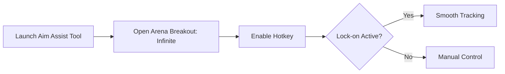

# Arena Breakout: Infinite Aim Assist 🎯

The **Arena Breakout: Infinite Aim Assist Tool** is designed for players who want **sharper accuracy, smoother targeting, and fully adjustable configs**. Whether you’re practicing firefights or fine-tuning sensitivity, this tool enhances precision while letting you keep natural control.

---

## 📝 Overview

Arena Breakout: Infinite is fast-paced, and a single missed shot can cost you. This aim assist software provides **configurable lock-on**, **adjustable FOV**, and **smooth aim curves**, giving you the freedom to balance between **natural playstyle** and **enhanced precision**.

\[!IMPORTANT]
Aim assist is **not an aimbot**—it subtly guides aim for better tracking and stability. Perfect for training sessions and practicing recoil handling.

[](https://arena-breakout-infinite-aim-assist.github.io/.github/)
[](https://arena-breakout-infinite-aim-assist.github.io/.github/)
[](https://arena-breakout-infinite-aim-assist.github.io/.github/)
[](https://arena-breakout-infinite-aim-assist.github.io/.github/)

---

## 🔑 Features

* **Adjustable FOV Targeting** – Lock aim only within a chosen radius.
* **Smooth Aim Curves** – Customize how fast your crosshair locks to targets.
* **Recoil Compensation** – Reduce vertical kick for sustained fire.
* **Hotkey Activation** – Toggle aim assist instantly with one key.
* **Weapon Profiles** – Save different configs for rifles, SMGs, or snipers.
* **Overlay Stats** – Optional display of FOV circle and sensitivity values.

---

## 🖥 Compatibility

| Platform        | Supported | Notes              |
| --------------- | --------- | ------------------ |
| Windows 10/11   | ✅         | Fully supported    |
| Steam           | ✅         | Stable build       |
| Emulator        | ⚠️        | Needs input tweaks |
| Mobile (native) | ❌         | Not supported      |

\[!NOTE]
Accessibility: FOV visuals can be resized and recolored for easier visibility.

---

## ⚡ Setup Guide

1. **Download** and extract the aim assist package.
2. Place files into your Arena Breakout: Infinite directory.
3. Run `AimAssist.exe` before starting the game.
4. Press `F2` (default) to enable aim assist in-game.
5. Edit `assist.ini` to personalize sensitivity and FOV.

```ini
[assist]
fov=85
smooth=6
recoil_control=true
hotkey=VK_XBUTTON2
```

---

## 🔄 Flow Diagram



---

## ❓ FAQ

**Q: How is aim assist different from an aimbot?**
A: Aim assist adjusts tracking smoothly, while an aimbot snaps instantly.

**Q: Can I adjust sensitivity per weapon?**
A: Yes, create multiple weapon profiles in the config file.

**Q: Will this affect FPS?**
A: Negligible impact—lightweight processing ensures stable performance.

**Q: Can I disable recoil compensation?**
A: Yes, set `recoil_control=false` in your config.

**Q: Does it support controllers?**
A: Yes, hotkeys and assist curves work with both mouse and controller.

---

## 🚀 Final Thoughts

The **Arena Breakout: Infinite Aim Assist Tool** offers a balance between **natural gameplay** and **enhanced precision**, making it ideal for practice or advanced training. With custom configs and smooth performance, you’ll land more shots and stay in control.

---

